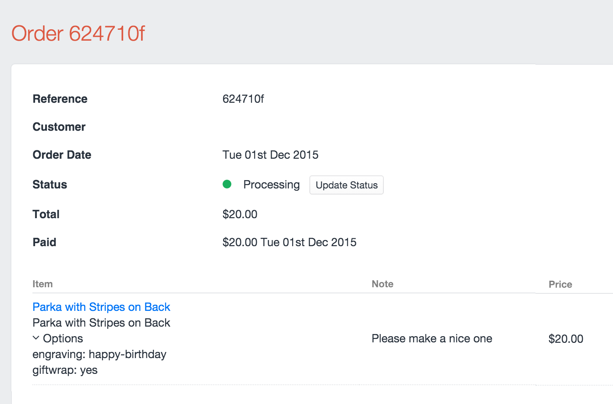

# Add to Cart

To add something to the cart, submit the ID of a [purchasable](purchasables.md) element as a `purchasableId` param to the `commerce/cart/update-cart` action.

::: tip
Products are not purchasable on their own; all products have at least one default variant. See [Products](products.md) for more information.
:::

The following is an example of getting the first product found in your store. We then get the product’s default variant and use its ID in the form that will add that item to the cart:

```twig



<form method="POST">
    <input type="hidden" name="action" value="commerce/cart/update-cart">
    {{ redirectInput('shop/cart') }}
    <input type="hidden" name="qty" value="1">
    <input type="hidden" name="purchasableId" value="{{ variant.id }}">
    <input type="submit" value="Add to cart">
</form>
```
* The `qty` param is not required as it defaults to `1` if not supplied.

The above is a simple example, if your product’s type has multiple variants you could loop over all the products variants and allow the customer to choose the variant from a dropdown:

```twig


<form method="POST">
    <input type="hidden" name="action" value="commerce/cart/update-cart">
    {{ redirectInput('shop/cart') }}
    {{ csrfInput() }}
    <input type="hidden" name="qty" value="1">
    <select name="purchasableId">
        
            <option value="{{ variant.id }}">{{ variant.sku }}</option>
        
    </select>
    <input type="submit" value="Add to cart">
</form>
```

::: warning
In the Lite edition of Craft Commerce only single line item can exist in the cart. Whenever a customer adds something to the cart, it replaces whatever item was in the cart.
If multiple items are added to the cart in a single request, only the last item submitted is added to the cart.    
:::

::: warning
When using the `commerce/cart/update-cart` form action, the redirect is only followed if *all* updates submitted succeed.
:::

## Line item options and notes

When submitting a product to the cart, you can optionally include a text note from the customer, or arbitrary data in an options param.

Here is an example of an add to cart form with both a `notes` and `options` param.

```twig


<form method="POST">
    <input type="hidden" name="action" value="commerce/cart/update-cart">
    {{ redirectInput('shop/cart') }}
    {{ csrfInput() }}
    <input type="hidden" name="qty" value="1">

    <input type="text" name="note" value="">

    <select name="options[engraving]">
        <option value="happy-birthday">Happy Birthday</option>
        <option value="good-riddance">Good Riddance</option>
    </select>

    <select name="options[giftwrap]">
        <option value="yes">Yes Please</option>
        <option value="no">No Thanks</option>
    </select>

    <input type="hidden" name="purchasableId" value="{{ variant.id }}">
    <input type="submit" value="Add to cart">
</form>
```

In the above example we:

- Allowed a customer to input a `note` with a text field.
- Allowed a customer to choose an option called `engraving` with 2 prepared values.
- Allowed a customer to choose an option called `giftwrap` with 2 prepared values.

::: warning
The options and notes param data is not validated. A user could submit any data. Use front-end validation.
:::

Once the order is complete, the notes and options can be found on the View Order page.



## Options uniqueness

The options data submitted to the line item are hashed into an `optionsSignature` for uniqueness. If you submit the same purchasable ID to the cart with different option data, two line items will be created.

Another way to think about it is that each line item is unique based on the combination of `purchasableId` and `optionsSignature`.

## Adding multiple purchasables to the cart

You can add multiple purchasables to the cart in an update cart form. You supply the data to the controller in a different format. All purchasables IDs are supplied in a `purchasables` form array like so:

```twig

<form method="POST">
    <input type="hidden" name="action" value="commerce/cart/update-cart">
    {{ redirectInput('shop/cart') }}
    {{ csrfInput() }}

    
        <input type="hidden" name="purchasables[{{loop.index}}][id]" value="{{ variant.id }}">
        <input type="hidden" name="purchasables[{{loop.index}}][qty]" value="1">
        <input type="hidden" name="purchasables[{{loop.index}}][note]" value="1">
    

    <input type="submit" value="Add all variants to cart">
</form>
```

While using multi-add the same rules apply for updating a quantity vs adding to cart, based on the uniquessness of the options `signature` and `purchasableId`.

As shown in the example above,  a unique index key is required to group the purchasable ID to its related `notes` and `options` and `qty` param. Using `{{loop.index}}` is an easy way to do this.

## Updating line items

Once the purchasable has been added to the cart, your customer may want to update the `qty` or `note`, they can do this by updating a line item.

Line items can have their `qty`, `note`, and `options`updated. They can also be removed.

To update a line item, submit a form array param with the name of `lineItems`, with the ID of the array key being the line item ID.

Example:

```twig
<form method="POST">
    <input type="hidden" name="action" value="commerce/cart/update-cart">
    {{ redirectInput('shop/cart') }}
    {{ csrfInput() }}
    <input type="text" placeholder="My Note" name="lineItems[LINE_ITEM_ID][note]" value="{{ item.note }}">
    <input type="number" name="lineItems[LINE_ITEM_ID][qty]" min="1" value="{{ item.qty }}">
    <input type="submit" value="Update Line Item">
</form>
```

In the example above we are allowing for the editing of one line item. You would replace `LINE_ITEM_ID` with the ID of the line item you wanted to edit. Usually you would just loop over all line items and insert `{{ item.id }}` there, allowing your customers to update multiple line items at once.

To remove a line item, simply send a `lineItems[LINE_ITEM_ID][remove]` param in the request. You could do this by adding a checkbox to the form above that looks like this:

```twig
<input type="checkbox" name="lineItems[LINE_ITEM_ID][remove]" value="1"> Remove item<br>
```

The example templates contain all of the above examples of adding and updating the cart within a full checkout flow.

## Cart Merging

By default the current cart begins blank and customers add things to it.

If the customer is a registered user they may expect to be able to log into another computer and continue their cart from 
a previous session. If the user arrives at the store page logged-in, without a cart in session the most recent cart belonging to that user is restored to the session.  

If the user logs in, but already has a cart in session (even an empty one), this does not happen automatically.

When retrieving the current cart you can optionally tell the system to merge in the line items from a previous session 
in 2 ways:

1) Submit the `mergeCarts` parameter in either the `commerce/cart/get-cart` ajax controller action or the `commerce/cart/update-cart` controller action.

`<input type="hidden" name="mergeCarts" value="commerce/cart/update-cart">`

2) Instead of calling `` in your twig template, call `craft.commetce.cart.mergedCart`.

Please note, using the above two methods will only merge previous carts of a logged-in user and only carts that belong to that user. If the user is a guest, no errors are raised, and everything behaves as normal.

Calling `craft.commetce.cart.mergedCart` which the user is a guest behaves the same way as `craft.commetce.cart.cart`, so there is no harm in using it on most cart pages. 

You might not want to use it on final checkout pages, so that customers don't get confused seeing new items in the cart before payment.

Before merging, you may want to show the user what will be merged. 

You could do this by showing the other cart’s contents from the previous session with:

`{% set otherCarts = craft.orders.isCompleted(false).user(currentUser).id('not ' ~ cart.id).all()`

The above query gets all carts for the current user, excluding the current cart.