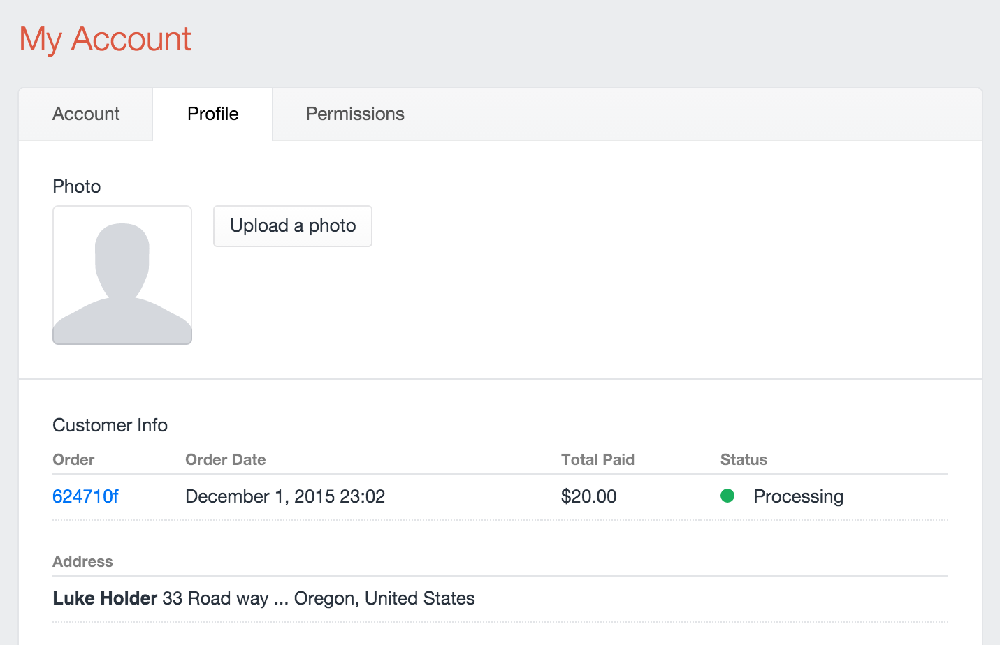

# Customer Info Fields

## General

The Customer Info field allows you to add Commerce related customer information to the Craft user field layout. This allows you to see the past orders for a customer as well as all addresses they have in their address book.



## Templating

If you named your customer info field `customerInfo`, you would be able to have a <api:craft\commerce\models\Customer> object returned for a user like so:

```twig

```

Example of getting the customers addresses:

```twig

    {{ address.firstName}} <br>

```

Example of getting the customers past orders:

```twig

    {{ order.number}} <br>

```
