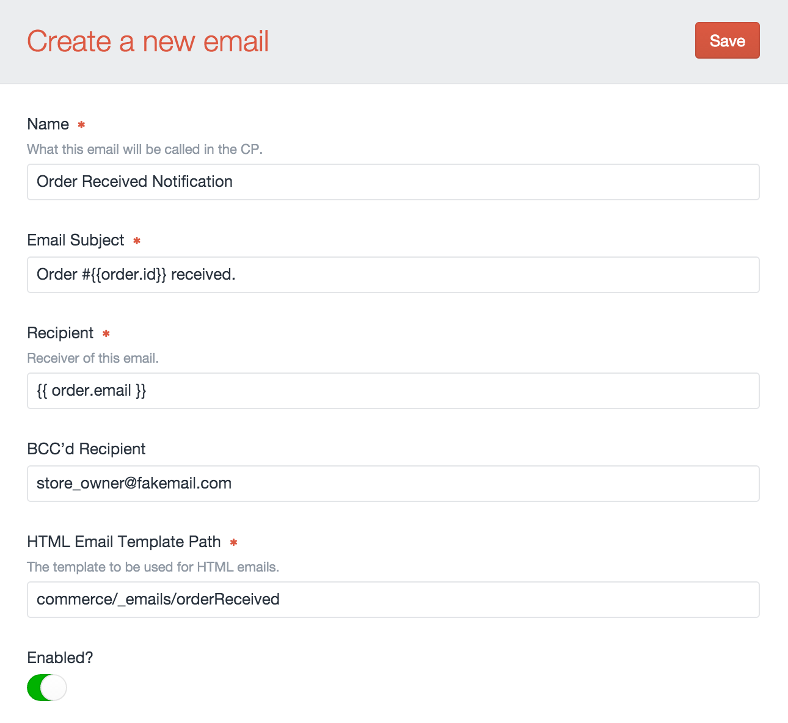

# Order Status Emails

In addition to using order statuses to manage your orders, you can choose emails that will be sent when an order moves into that status.

For example you might create an Email called “Order Confirmation for Customer” which confirms the order has been completed and is sent to the customer. This email should likely be linked to the default order status, since we want it to trigger when the cart is completed and becomes an order.

Another email could be set up called “Order Notification for Admin” which could also be attached to the default order status, but gets set to the store owners email address.

## Settings

Before setting up emails for Craft Commerce. Ensure that your Craft CMS installation has email configured correctly.

You can set up your email gateway by going to Settings → Email in the Control Panel.

If you want to have a different From Email and From Name for your Commerce store emails, which overrides the Craft CMS email defaults, go to Commerce → Settings → General Settings and enter in your store from name and email address.



## Creating an Email

To create a new email, go to Commerce → Settings → Emails, and click “New Email”.

Emails have the following configuration settings:

### Name

Enter the name of this email as it will be shown when managing it in the Control Panel.

### Email Subject

The subject of the email.
Plain text can be entered or twig can also be used to set dynamic values.
Two special variables available to you:

- `order` – a <api:craft\commerce\elements\Order> object.
- `orderHistory` – a <api:craft\commerce\models\OrderHistory> object.

`order` is the current cart or order that this email is a notification for. For example, for the subject we might use a template like:

```twig
Order #{{ order.id }} received.`
```

### Recipient

The “To” address or addresses for this email.

If “Send to the customer” is selected, the email will only be sent to the customer of the order, and will be sent in the language (locale) that customer made the order in. This affects the use of the `|t` filter in other email fields  that support twig.

If “Send to custom recipient” is selected, an email address can be entered. Please note the language of this email will be in the language of the current user triggering the status change.

Plain text can be entered or twig can also be used to set dynamic values.
Two special variables available to you:

- `order` – a <api:craft\commerce\elements\Order> object.
- `orderHistory` – a <api:craft\commerce\models\OrderHistory> object.

`order` is the current cart or order that this email is a notification for. For example, for the subject we might use a template like:

```twig
{{ order.email }}`
```

This would send the email to the customer to made this order.

### BCC’d Recipient

The BCC addresses for this email. You can separate the addresses by a comma: `,`.

Plain text can be entered or twig can also be used to set dynamic values.

Two special variables available to you:

- `order` – a <api:craft\commerce\elements\Order> object.
- `orderHistory` – a <api:craft\commerce\models\OrderHistory> object.

Most likely, you would BCC the store owner on order confirmation.

### HTML Email Template Path

The template path to a template in your site templates folder.
Plain text template path can be entered or Twig code can also be used to set dynamic values.

You can use the following variables in both the template path & template file body:

- `order` – a <api:craft\commerce\elements\Order> object.
- `orderHistory` – a <api:craft\commerce\models\OrderHistory> object.

This allows you to have full design flexibility.

::: warning
Craft global set variables are not loaded automatically into your email templates. See below for a work-around
:::

To get access to global set variables you need to manually load them into your templates like so:

```


{{ globalSetName.customFieldName }}
```

Further documentation on the `craft.globals` twig function are available [here](https://craftcms.com/docs/templating/craft.globals).
